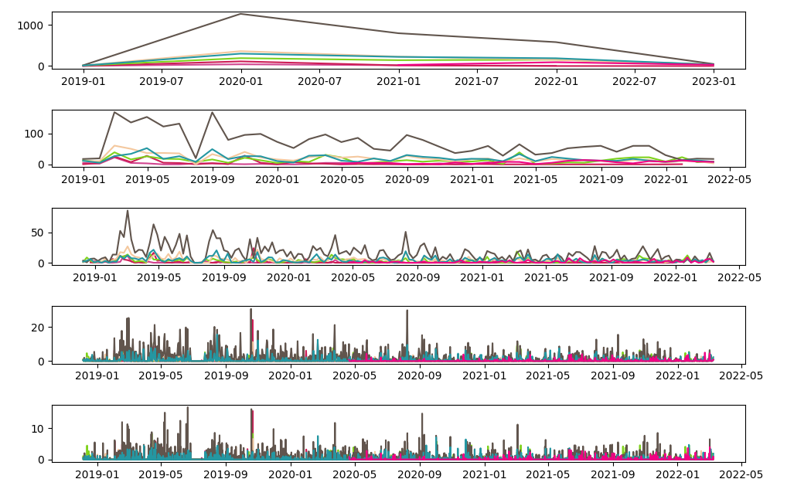

# PoC-Can-I-borrow-a-feelin

## Description

The goal of this project is to materialize an idea:

Draw on a graph the variation of emotions in the flow of a conversation.

Invidivual chat:


Group Chat



## Export Whatsapp Chat

- Go to WhatsApp
- Go to a Chat
- More options (three dots)
- More
- Export
- Export without multimedia

## Configuration

There are two variables:

- FILE: Chat file location (absolute path)
- FREQS: Frequencies that Pandas uses to resample the data by date-ranges ('Y' == Year, 'W' == Week, ...)
- ANONYMIZE: Don't display names on the legends

```python
FILE = "/path/to/file.txt"
FREQS = [ 'Y', 'M', 'W', 'D', 'H', ]
ANONYMIZE = True/False
```

## Usage

```bash
virtualenv .env
source .env/bin/activate
pip install -r requirements
python3 app.py
```
 
## Spanish Sentiment Analysis

[sentiment-analysis-spanish](https://github.com/sentiment-analysis-spanish/sentiment-spanish)

THANKS YOU SO MUCH!! 